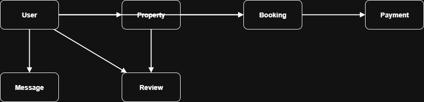

# Airbnb Database – ERD Documentation  

## 📖 Overview
This document describes the **Entity-Relationship Diagram (ERD)** for the Airbnb-like database system.  
It covers the **entities, attributes, and relationships** needed to model users, properties, bookings, payments, reviews, and messages.

---

## 🏗 Entities
1. **User** – Stores user details (guests, hosts, admins).  
2. **Property** – Represents listings created by hosts.  
3. **Booking** – Tracks reservations made by guests for properties.  
4. **Payment** – Records payments for bookings.  
5. **Review** – Captures guest feedback on properties.  
6. **Message** – Supports user-to-user communication.  

---

## 🔗 Relationships
- A **User (host)** can list many **Properties**.  
- A **User (guest)** can make many **Bookings**.  
- A **Property** can have many **Bookings**.  
- A **Booking** can have one or many **Payments**.  
- A **User** can leave many **Reviews** on **Properties**.  
- **Messages** connect Users (sender → recipient).  

---

## 🎨 ERD Diagram
Below is the visual representation of the database schema:  

  

---

## ✅ Notes
- Primary Keys (PK) and Foreign Keys (FK) are represented by relationships in the diagram.  
- Unique constraints include **User.email**.  
- Normalization applied up to **3rd Normal Form (3NF)**.  
- Indexes added on frequently queried fields (e.g., `email`, `property_id`, `booking_id`).  

---

